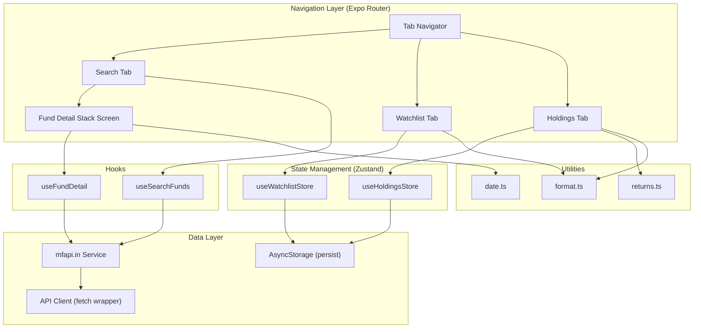

# Design Document: Mutual Fund Explorer

## Overview

The Mutual Fund Explorer is a React Native feature built with Expo SDK 57 that allows users to search Indian mutual fund schemes, view NAV history with interactive charts, maintain a watchlist, and track holdings with computed returns. It integrates with the free mfapi.in API and persists user data locally using AsyncStorage with Zustand state management.

The design prioritizes:
- **Incremental loading**: Screens fetch data on demand with proper loading/error states
- **Offline resilience**: Persisted stores provide last-known data when offline
- **Performance**: FlatList virtualization, chart data downsampling, and debounced search
- **Correctness**: Pure utility functions for formatting and computation, testable in isolation

## Architecture



### Key Architectural Decisions

| Decision | Choice | Rationale |
|----------|--------|-----------|
| State management | Zustand | Lightweight, TypeScript-friendly, built-in persist middleware works with AsyncStorage |
| API layer | Custom fetch wrapper | Minimal overhead, handles retries/timeouts without heavy dependency |
| Charts | react-native-gifted-charts | No native dependencies, works across platforms, good performance |
| Navigation | Expo Router file-based | Already in use in the project, native tab support via NativeTabs |
| Persistence | @react-native-async-storage/async-storage | Standard for Expo, works with Zustand persist middleware |
| Search debounce | Custom hook with setTimeout | Simple, no extra dependency needed |

## Components and Interfaces

### Navigation Structure

```
src/app/
  _layout.tsx              → Root Stack Navigator
  (tabs)/
    _layout.tsx            → Tab Navigator (Search, Watchlist, Holdings)
    index.tsx              → Search Screen
    watchlist.tsx          → Watchlist Screen
    holdings.tsx           → Holdings Screen
  fund/
    [schemeCode].tsx       → Fund Detail Screen (stack push)
```

### Screen Components

#### SearchScreen (`src/app/(tabs)/index.tsx`)
- Text input with debounce (300ms)
- Minimum 3 characters before triggering search
- FlatList of results with scheme name + code
- States: idle, loading, results, empty, error

#### FundDetailScreen (`src/app/fund/[schemeCode].tsx`)
- Header: fund name, scheme code, latest NAV, last updated
- Line chart (react-native-gifted-charts)
- Time range filter pills: 1M, 3M, 6M, 1Y, All (shown when > 365 entries)
- Scrollable NAV history list
- Action buttons: Add to Watchlist, Add Holding
- Holdings form modal (units + purchase date)

#### WatchlistScreen (`src/app/(tabs)/watchlist.tsx`)
- FlatList of watchlist items with swipe-to-delete
- Each item: fund name, latest NAV (₹ formatted), last updated
- Stale data indicator when NAV fetch fails
- Empty state with guidance message

#### HoldingsScreen (`src/app/(tabs)/holdings.tsx`)
- FlatList of holdings with swipe-to-delete
- Each item: fund name, units, purchase NAV, current NAV, current value (₹), return (₹ + %)
- Color coding: green for positive returns, red for negative
- Empty state with guidance message

### Shared UI Components

```
src/components/
  ui/
    LoadingIndicator.tsx   → Centered spinner with optional message
    ErrorState.tsx         → Error message + retry button
    EmptyState.tsx         → Icon + message + optional CTA
    INRText.tsx            → Formatted currency display
  search/
    SearchInput.tsx        → Debounced text input
    SearchResultItem.tsx   → Single search result row
  fund-detail/
    NAVChart.tsx           → Line chart wrapper with downsampling
    NAVHistoryList.tsx     → Virtualized NAV entry list
    TimeRangeFilter.tsx    → Filter pill buttons
    HoldingForm.tsx        → Modal form for adding holding
  watchlist/
    WatchlistItem.tsx      → Single watchlist row with stale indicator
  holdings/
    HoldingItem.tsx        → Single holding row with returns
```

### Custom Hooks

#### `useSearchFunds(query: string)`
```typescript
interface UseSearchFundsResult {
  results: FundSearchResult[];
  isLoading: boolean;
  error: string | null;
  retry: () => void;
}
```
- Debounces input (300ms)
- Only fires when query.length >= 3
- Cancels in-flight requests on new query

#### `useFundDetail(schemeCode: string)`
```typescript
interface UseFundDetailResult {
  fund: FundDetail | null;
  isLoading: boolean;
  error: string | null;
  retry: () => void;
}
```
- Fetches on mount
- Parses date strings into Date objects for chart/filtering

## Data Models

### TypeScript Interfaces

```typescript
// src/types/fund.ts

export interface FundSearchResult {
  schemeCode: number;
  schemeName: string;
}

export interface NAVEntry {
  date: string;       // "dd-MM-yyyy" format from API
  nav: string;        // String from API, parsed to number for display
}

export interface FundMeta {
  fund_house: string;
  scheme_type: string;
  scheme_category: string;
  scheme_code: number;
  scheme_name: string;
}

export interface FundDetail {
  meta: FundMeta;
  data: NAVEntry[];   // Sorted newest first from API
}

export interface WatchlistItem {
  schemeCode: number;
  schemeName: string;
  latestNAV?: number;
  lastUpdated?: string;
  isStale?: boolean;
}

export interface HoldingRecord {
  id: string;          // UUID for unique identification
  schemeCode: number;
  fundName: string;
  units: number;
  purchaseDate: string; // ISO date string
  purchaseNAV?: number; // Resolved from NAV history
  currentNAV?: number;
  currentValue?: number;
  returnAmount?: number;
  returnPercentage?: number;
}

export type TimeRange = '1M' | '3M' | '6M' | '1Y' | 'ALL';
```

### Zustand Store Interfaces

```typescript
// src/stores/watchlist-store.ts
interface WatchlistStore {
  items: WatchlistItem[];
  addToWatchlist: (schemeCode: number, schemeName: string) => void;
  removeFromWatchlist: (schemeCode: number) => void;
  isInWatchlist: (schemeCode: number) => boolean;
  refreshNAVs: () => Promise<void>;
}

// src/stores/holdings-store.ts
interface HoldingsStore {
  holdings: HoldingRecord[];
  addHolding: (holding: Omit<HoldingRecord, 'id' | 'currentNAV' | 'currentValue' | 'returnAmount' | 'returnPercentage'>) => void;
  removeHolding: (id: string) => void;
  refreshHoldings: () => Promise<void>;
}
```

### API Client

```typescript
// src/services/api.ts
interface APIConfig {
  baseURL: string;
  timeout: number;
  retries: number;
}

async function fetchWithRetry<T>(url: string, config?: Partial<APIConfig>): Promise<T>;

// src/services/mf-api.ts
async function searchFunds(query: string): Promise<FundSearchResult[]>;
async function getFundDetail(schemeCode: number): Promise<FundDetail>;
```

### Utility Function Signatures

```typescript
// src/utils/format.ts
function formatINR(amount: number): string;           // "₹1,23,456.78"
function formatNAV(nav: number): string;              // "123.4567" (up to 4 decimals)
function formatUnits(units: number): string;          // "123.456" (up to 3 decimals)
function formatPercentage(pct: number): string;       // "12.34%" or "-5.67%"

// src/utils/date.ts
function parseNAVDate(dateStr: string): Date;         // "dd-MM-yyyy" → Date
function formatDisplayDate(date: Date): string;       // Date → "dd MMM yyyy"
function findNearestTradingDay(
  targetDate: Date, 
  navEntries: NAVEntry[]
): NAVEntry | null;

// src/utils/returns.ts
function computeCurrentValue(units: number, currentNAV: number): number;
function computeReturn(units: number, currentNAV: number, purchaseNAV: number): {
  returnAmount: number;
  returnPercentage: number;
};

// src/utils/chart.ts
function downsampleNAVData(data: NAVEntry[], maxPoints: number): NAVEntry[];
function filterByTimeRange(data: NAVEntry[], range: TimeRange): NAVEntry[];
```

## Correctness Properties

*A property is a characteristic or behavior that should hold true across all valid executions of a system — essentially, a formal statement about what the system should do. Properties serve as the bridge between human-readable specifications and machine-verifiable correctness guarantees.*

### Property 1: Time range filter correctness

*For any* NAV history array and any selected time range (1M, 3M, 6M, 1Y), all entries in the filtered result SHALL have dates within the selected range relative to the most recent entry, and no valid entries within the range SHALL be excluded.

**Validates: Requirements 2.7**

### Property 2: Returns computation correctness

*For any* valid holding with positive units, a positive currentNAV, and a positive purchaseNAV: currentValue SHALL equal units × currentNAV, returnAmount SHALL equal currentValue − (units × purchaseNAV), and returnPercentage SHALL equal (returnAmount / investedValue) × 100.

**Validates: Requirements 4.4, 4.5**

### Property 3: Nearest preceding trading day lookup

*For any* sorted array of NAV entries and any target date, the result of findNearestTradingDay SHALL return the entry with the maximum date that is less than or equal to the target date, or null if no such entry exists.

**Validates: Requirements 4.6**

### Property 4: Holdings form rejects all invalid inputs

*For any* input where units is not a positive number, OR purchase date is in the future, OR purchase date is before the fund's earliest NAV date, the validation function SHALL return an error and prevent submission.

**Validates: Requirements 5.1, 5.2, 5.3**

### Property 5: Holdings form accepts all valid inputs

*For any* input where units is a positive number AND purchase date is not in the future AND purchase date is on or after the fund's earliest NAV date, the validation function SHALL return valid and allow submission.

**Validates: Requirements 5.4**

### Property 6: INR formatting structure

*For any* non-negative number, formatINR SHALL produce a string that starts with "₹", uses the Indian numbering system (rightmost group of 3 digits, subsequent groups of 2 digits), and correctly represents the numeric value.

**Validates: Requirements 6.1**

### Property 7: NAV decimal formatting

*For any* number, formatNAV SHALL produce a string with at most 4 digits after the decimal point, and the numeric value of the output SHALL be within rounding tolerance of the input.

**Validates: Requirements 6.2**

### Property 8: Units decimal formatting

*For any* number, formatUnits SHALL produce a string with at most 3 digits after the decimal point, and the numeric value of the output SHALL be within rounding tolerance of the input.

**Validates: Requirements 6.3**

### Property 9: Percentage formatting

*For any* number, formatPercentage SHALL produce a string ending with "%" that has exactly 2 decimal places before the percent sign, and the numeric value SHALL be within rounding tolerance of the input.

**Validates: Requirements 6.4**

### Property 10: Return color classification

*For any* return value, the color classification function SHALL return "red" for negative values and "green" for zero or positive values. This mapping SHALL be deterministic and consistent.

**Validates: Requirements 6.5**

## Error Handling

### API Error Strategy

| Error Type | Detection | User-Facing Behavior |
|-----------|-----------|---------------------|
| Network unavailable | fetch throws TypeError | Show error state with "No internet connection" + retry button |
| Timeout (10s) | AbortController signal | Show error state with "Request timed out" + retry button |
| Server error (5xx) | Response status >= 500 | Retry up to 2 times with exponential backoff, then show error |
| Client error (4xx) | Response status 400-499 | Show error state with descriptive message |
| Invalid response | JSON parse failure | Show generic error + retry button |

### Retry Strategy

```typescript
const RETRY_CONFIG = {
  maxRetries: 2,
  baseDelay: 1000,      // 1 second
  maxDelay: 5000,       // 5 seconds
  backoffMultiplier: 2,
};
```

### Graceful Degradation

- **Watchlist**: If individual NAV fetch fails, show item with stale indicator (last known NAV + timestamp)
- **Holdings**: If NAV unavailable for purchase date, show "Returns unavailable" instead of crashing
- **Offline mode**: Display cached watchlist/holdings from AsyncStorage; disable search

### Form Validation Errors

Validation errors are displayed inline below the respective input field. The form does not submit until all validation passes. Validation runs on both change and blur events for immediate feedback.

## Testing Strategy

### Testing Framework

- **Unit tests**: Jest (included with Expo) + React Native Testing Library
- **Property tests**: fast-check (TypeScript property-based testing library)
- **Test location**: `__tests__/` directories colocated with source

### Property-Based Tests (fast-check)

Each correctness property maps to a dedicated property test file. Configuration: minimum 100 iterations per property.

| Property | Test File | What's Generated |
|----------|-----------|-----------------|
| P1: Time range filter | `src/utils/__tests__/chart.property.test.ts` | Random NAV arrays + time ranges |
| P2: Returns computation | `src/utils/__tests__/returns.property.test.ts` | Random (units, currentNAV, purchaseNAV) tuples |
| P3: Nearest trading day | `src/utils/__tests__/date.property.test.ts` | Random sorted date arrays + target dates |
| P4: Invalid input rejection | `src/utils/__tests__/validation.property.test.ts` | Random invalid inputs (negative units, future dates, too-early dates) |
| P5: Valid input acceptance | `src/utils/__tests__/validation.property.test.ts` | Random valid inputs |
| P6: INR formatting | `src/utils/__tests__/format.property.test.ts` | Random positive numbers |
| P7: NAV formatting | `src/utils/__tests__/format.property.test.ts` | Random decimals |
| P8: Units formatting | `src/utils/__tests__/format.property.test.ts` | Random decimals |
| P9: Percentage formatting | `src/utils/__tests__/format.property.test.ts` | Random numbers |
| P10: Color classification | `src/utils/__tests__/format.property.test.ts` | Random numbers (positive and negative) |

### Unit Tests (Example-Based)

- **API service**: Mock fetch, test request formation, error mapping
- **Zustand stores**: Test add/remove operations, persistence calls
- **Custom hooks**: Mock API layer, test state transitions (loading → success/error)
- **Screen components**: Render with mocked data, verify key elements present
- **Validation**: Specific edge cases (0, empty string, exactly earliest date)

### Performance Testing

- Manual verification: Render 2000+ NAV entries in FlatList, verify smooth scrolling
- Chart downsampling: Verify chart renders with max 100 data points regardless of input size

### Test Tag Format

Property tests will include comments referencing the design property:
```typescript
// Feature: mutual-fund-explorer, Property 2: Returns computation correctness
```
